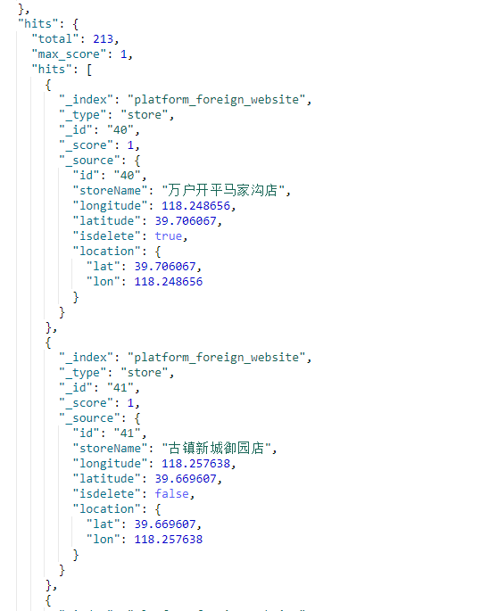

### 范围查询（range query）

------

范围查询用于匹配某些字段的字段值位于特定范围内的文档。Lucene查询的类型依赖于字段的类型，对于字符串字段，是TermRangeQuery，而对于数字/日期字段，查询是NumericRangeQuery。

```json
GET _search
{
  "query": {
    "range": {
      "age": {
          "gte": 25,
          "lte": 30
      }
    }
  }
}
1234567891011
```

note：查询age字段大于等于25小于等于30的文档。

范围查询接收以下参数：

- gte：大于等于
- gt：大于
- lte：小于等于
- lt：小于
- boost：设置查询的推动值（boost），默认为1.0

#### 日期字段的范围

当范围查询运行在日期类型的字段上时，可以通过日期数学指定范围。

```json
GET _search
{
    "query": {
        "range" : {
            "date" : {
                "gte" : "now-1d/d",
                "lt" :  "now/d"
            }
        }
    }
}
1234567891011
```

**日期数学与舍入**
当使用日期数学将日期舍入到最近的天、月、小时等时，舍入后的日期依赖于范围的边界是否被包含。

向上舍入移动到舍入范围的最后一毫秒，向下舍入移动到舍入范围的第一毫秒。

- gt：大于舍入的日期，2014-11-18||/M变为2014-11-30T23:59:59.999，即不包括整个月。
- gte：大于等于舍入的日期，2014-11-18||/M变为2014-11-01，即包括整个月。
- lt：小于舍入的日期，204-11-18||/M变为2014-11-01，即不包括整个月。
- lte：小于等于舍入的日期，2014-11-18||/M变为2014-11-30T23:59:59.999，即包含整个月。

**范围查询中的日期格式**
默认使用设置在日期字段中的format参数解析格式化日期，但是，此参数可以通过在范围查询中设置format参数来进行覆盖。

```json
GET _search
{
    "query": {
        "range" : {
            "born" : {
                "gte": "01/01/2012",
                "lte": "2013",
                "format": "dd/MM/yyyy||yyyy"
            }
        }
    }
}
123456789101112
```

**范围查询中的时区**
通过在日期值中指定时区或使用time_zone参数指定时区，可以转换日期时区。

```json
GET _search
{
    "query": {
        "range" : {
            "timestamp" : {
                "gte": "2015-01-01 00:00:00", 
                "lte": "now", 
                "time_zone": "+01:00"
            }
        }
    }
}
123456789101112
```

note：gte参数的日期值将会被转化为2014-12-31T23:00:00 UTC
note：now不会被time_zone参数影响（日期必须存储为UTC）


### Elasticsearch Java API 的使用（5）— 范围查询（时间范围查询示例）

#### Java 范围查询（时间范围查询示例）

RangeQueryBuilder 构建**范围查询条件**；
可以使用 RangeQueryBuilder 作为时间范围查询。
示例如下：

```java 
public class EsRange{
    public void RangeSearch(TransportClient client){
        //时间范围的设定
        RangeQueryBuilder rangequerybuilder = QueryBuilders
                    .rangeQuery("inputtime")
                    .from("2016-7-21 00:00:01").to("2016-7-21 00:00:03");
        //生成DSL查询语句
        SearchSourceBuilder sourceBuilder = new SearchSourceBuilder();
        sourceBuilder.query(rangequerybuilder);

        //System.out.println(sourceBuilder.toString());

        //查询建立
        SearchRequestBuilder responsebuilder = client
                                .prepareSearch("pointdata")
                                .setTypes("pointdata");
        SearchResponse myresponse=responsebuilder
                    .setQuery(QueryBuilders.boolQuery() 
                    .must(QueryBuilders.matchPhraseQuery //must表示and                    
                        ("pointid","W3.UNIT1.10LBG01CP301")
                    )
                    .must(rangequerybuilder))
                    .setFrom(0).setSize(50) //分页
                    .setExplain(true)
                    .execute()
                    .actionGet();
        SearchHits hits = myresponse.getHits();
        for(int i = 0; i < hits.getHits().length; i++) {
            System.out.println(hits.getHits()[i].getSourceAsString());
        }
    }
}
```


### [Elasticsearch 范围查询](https://www.cnblogs.com/ExMan/p/12916977.html)


```java
范围查询（range query）
范围查询用于匹配某些字段的字段值位于特定范围内的文档。Lucene查询的类型依赖于字段的类型，对于字符串字段，是TermRangeQuery，而对于数字/日期字段，查询是NumericRangeQuery。

GET _search
{
  "query": {
    "range": {
      "age": {
          "gte": 25,
          "lte": 30
      }
    }
  }
}
note：查询age字段大于等于25小于等于30的文档。

范围查询接收以下参数：

gte：大于等于
gt：大于
lte：小于等于
lt：小于
boost：设置查询的推动值（boost），默认为1.0
日期字段的范围
当范围查询运行在日期类型的字段上时，可以通过日期数学指定范围。

GET _search
{
    "query": {
        "range" : {
            "date" : {
                "gte" : "now-1d/d",
                "lt" :  "now/d"
            }
        }
    }
}
日期数学与舍入
当使用日期数学将日期舍入到最近的天、月、小时等时，舍入后的日期依赖于范围的边界是否被包含。

向上舍入移动到舍入范围的最后一毫秒，向下舍入移动到舍入范围的第一毫秒。

gt：大于舍入的日期，2014-11-18||/M变为2014-11-30T23:59:59.999，即不包括整个月。
gte：大于等于舍入的日期，2014-11-18||/M变为2014-11-01，即包括整个月。
lt：小于舍入的日期，204-11-18||/M变为2014-11-01，即不包括整个月。
lte：小于等于舍入的日期，2014-11-18||/M变为2014-11-30T23:59:59.999，即包含整个月。
范围查询中的日期格式
默认使用设置在日期字段中的format参数解析格式化日期，但是，此参数可以通过在范围查询中设置format参数来进行覆盖。

GET _search
{
    "query": {
        "range" : {
            "born" : {
                "gte": "01/01/2012",
                "lte": "2013",
                "format": "dd/MM/yyyy||yyyy"
            }
        }
    }
}
范围查询中的时区
通过在日期值中指定时区或使用time_zone参数指定时区，可以转换日期时区。

GET _search
{
    "query": {
        "range" : {
            "timestamp" : {
                "gte": "2015-01-01 00:00:00", 
                "lte": "now", 
                "time_zone": "+01:00"
            }
        }
    }
}

note：gte参数的日期值将会被转化为2014-12-31T23:00:00 UTC
note：now不会被time_zone参数影响（日期必须存储为UTC）
```

```java
范围搜索案例
2.1 制造数据
POST /forum/article/_bulk
{ "update": { "_id": "1"} }
{ "doc" : {"view_cnt" : 30} }
{ "update": { "_id": "2"} }
{ "doc" : {"view_cnt" : 50} }
{ "update": { "_id": "3"} }
{ "doc" : {"view_cnt" : 100} }
{ "update": { "_id": "4"} }
{ "doc" : {"view_cnt" : 80} }
复制代码
2.2 搜索浏览量在30~60之间的帖子
GET /forum/article/_search
{
  "query": {
    "constant_score": {
      "filter": {
        "range": {
          "view_cnt": {
            "gt": 30,
            "lt": 60
          }
        }
      }
    }
  }
}
复制代码
2.3 搜索发帖日期在最近1个月的帖子
POST /forum/article/_bulk
{ "index": { "_id": 5 }}
{ "articleID" : "DHJK-B-1395-#Ky5", "userID" : 3, "hidden": false, "postDate": "2017-03-01", "tag": ["elasticsearch"], "tag_cnt": 1, "view_cnt": 10 }
 
GET /forum/article/_search 
{
  "query": {
    "constant_score": {
      "filter": {
        "range": {
          "postDate": {
            "gt": "2017-03-10||-30d"
          }
        }
      }
    }
  }
}
 
GET /forum/article/_search 
{
  "query": {
    "constant_score": {
      "filter": {
        "range": {
          "postDate": {
            "gt": "now-30d"
          }
        }
      }
    }
  }
}
```


# [ElasticSearch 地理范围查询 距离 坐标集合](https://www.cnblogs.com/xiaoxiaoliu/p/11054405.html)

### 最近有两个需求是通过地图选择坐标，查询指定距离内的信息，和通过坐标集合组成不规则形状查询出不规则形状范围内的数据，在最起初我看到这个需求的时候第一个想法就是太复杂了，抵触。但是没有办法既然需求下来了只能硬着头皮上了，在调研之后最终还是决定了使用elasticsearch，下面就开始介绍如何使用elasticsearch来进行相关操作

## 设置数据格式

地理坐标点（geo-point） 是指地球表面可以用经纬度描述的一个点。地理坐标点可以用来计算两个坐标位置间的距离，或者判断一个点是否在一个区域中。地理坐标点不能被动态映射（dynamic mapping）自动检测，而是需要显式声明对应字段类型为 geo_point ,例子中的location字段

```
PUT platform_foreign_website
{
  "mappings": {
     "store":{
      "properties": {
         "id": {
            "type": "text"
            },
          "storeName": {
            "type": "text"
          },
          "location":{
            "type": "geo_point"
          }
    }
     }
  }
}
```

## 存储示例：



- 半角逗号分割的字符串形式 “lat,lon“
- 明确以 lat 和 lon 作为属性的对象
- 数组形式表示 [lon,lat]

> 需要特别注意的就是纬度在前边经度在后边（latitude,longitude），数组表示形式是经度在前纬度在后（[longitude,latitude]）

## geo_distance 找出指定位置在给定距离内的数据，相当于指定圆心和半径找到圆中点

- 找出两千米范围内的所有门店
- distance：距离 单位/km
- location：坐标点 圆心所在位置

### es代码示例

```
//无排序
GET platform_foreign_website/communit/_search
{
  "query": {
    "constant_score": {
      "filter": {
        "geo_distance": {
          "distance": "2km",
          "location": {
            "lat": 39.662263,
            "lon": 118.197815
          }
        }
      },
      "boost": 1.2
    }
  }
}

//带排序
GET platform_foreign_website/communit/_search
{
  "query": {
    "constant_score": {
      "filter": {
        "geo_distance": {
          "distance": "1km",
          "location": {
            "lat": 39.662263,
            "lon": 118.197815
          }
        }
      },
      "boost": 1.2
    }
  },"sort": [
    {
  "_geo_distance" : {
    "location" : [
      {
        "lat" : 40.010955,
        "lon" : 118.68545
      }
    ],
    "unit" : "km",
    "distance_type" : "arc",
    "order" : "asc",
    "validation_method" : "STRICT"
  }
}
  ]
}
```

### java代码示例:

> 这里选用的是ElasticsearchTemplate 模板，因为没有分页取值比较方便，可以根据自己的业务逻辑自行选择

```
//无排序
private List<Store> getStores(CommunityToStoreParameter communityToStoreParameter) {
        //拼接条件
        BoolQueryBuilder boolQueryBuilder = QueryBuilders.boolQuery();
        QueryBuilder isdeleteBuilder = QueryBuilders.termQuery("isdelete", false);
        // 以某点为中心，搜索指定范围
        GeoDistanceQueryBuilder distanceQueryBuilder = new GeoDistanceQueryBuilder("location");
        distanceQueryBuilder.point(communityToStoreParameter.getLatitude(), communityToStoreParameter.getLongitude());
        //查询单位：km
        distanceQueryBuilder.distance(communityAndStoresdistance, DistanceUnit.KILOMETERS);
        boolQueryBuilder.filter(distanceQueryBuilder);
        boolQueryBuilder.must(isdeleteBuilder);
        SearchQuery storesearchQuery = new NativeSearchQueryBuilder()
                .withIndices(ESIndexAndTypeConstant.INDEX_NAME)
                .withTypes(ESIndexAndTypeConstant.STORE_TYPE_NAME)
                .withQuery(boolQueryBuilder)
                .build();
        return elasticsearchTemplate.queryForList(storesearchQuery, Store.class);
    }
    
//有排序
private Page<Store> getStores(Integer page, Integer size, AroundStoreParameter aroundStoreParameter, Double latitude, Double longitude, QueryBuilder isdeleteBuilder) {
        Pageable pageable = PageRequest.of(page - 1, size);
        NativeSearchQueryBuilder nativeSearchQueryBuilder = new NativeSearchQueryBuilder();
        BoolQueryBuilder boolQueryBuilder = new BoolQueryBuilder();
        // 以某点为中心，搜索指定范围
        GeoDistanceQueryBuilder distanceQueryBuilder = new GeoDistanceQueryBuilder("location");
        distanceQueryBuilder.point(latitude, longitude);
        //查询单位：km
        distanceQueryBuilder.distance(aroundStoreParameter.getDistance(), DistanceUnit.KILOMETERS);
        boolQueryBuilder.filter(distanceQueryBuilder);
        boolQueryBuilder.must(isdeleteBuilder);
        nativeSearchQueryBuilder.withQuery(boolQueryBuilder);
        // 按距离升序
        GeoDistanceSortBuilder distanceSortBuilder =
                new GeoDistanceSortBuilder("location", latitude, longitude);
        distanceSortBuilder.unit(DistanceUnit.KILOMETERS);
        distanceSortBuilder.order(SortOrder.ASC);
        nativeSearchQueryBuilder.withSort(distanceSortBuilder);
        nativeSearchQueryBuilder.withPageable(pageable);
        return storeRepository.search(nativeSearchQueryBuilder.build());
    }
    
```

## geo_polygon（地理多边形查询）: 一个查询，查询多边形内的所有的点,实现地图画圈筛选

### es代码示例

```
GET platform_foreign_website/store/_search
{
  "query": {
   "bool": {
     "must": [
       {"match_all": {}}
     ],
     "filter": {
       "geo_polygon": {
         "location": {
           "points": [
            { "lat": 39.634863, "lon": 118.137071 },
            { "lat": 39.6349, "lon": 118.13291 },
            { "lat": 39.633121, "lon": 118.128941 },
            { "lat": 39.629607, "lon": 118.130915 },
            { "lat": 39.632696, "lon": 118.132769 },
            { "lat": 39.630513, "lon": 118.136018 }
           ]
         }
       }
     }
   }
  }
}
```

### java代码示例

```
public PageResultVO storeRange(Integer page, Integer size, List<StoreRangeParameter> storeRangeParameters) {
        Pageable pageable = PageRequest.of(page - 1, size);
        //坐标集合
        List<GeoPoint> geoPoints = storeRangeParameters.stream().map(a ->
                new GeoPoint(a.getLatitude(), a.getLongitude())
        ).collect(Collectors.toList());
        //拼接查询条件
        BoolQueryBuilder boolQueryBuilder = QueryBuilders.boolQuery();
        QueryBuilder locationBuilder = QueryBuilders.geoPolygonQuery("location", geoPoints);
        QueryBuilder isdeleteBuilder = QueryBuilders.termQuery("isdelete", false);
        boolQueryBuilder.filter(locationBuilder);
        boolQueryBuilder.must(isdeleteBuilder);
        SearchQuery communityNativeBuilder = new NativeSearchQueryBuilder()
                .withPageable(pageable)
                .withQuery(boolQueryBuilder)
                .build();
        Page<Community> communities = communityRepository.search(communityNativeBuilder);
        List<CommunityInfoResultVO> communityInfoResultVOList = communities.getContent().stream().map(community ->
                new CommunityInfoResultVO(community.getCommunityName(), community.getLongitude(), community.getLatitude())
        ).collect(Collectors.toList());
        return new PageResultVO<>(communities.getTotalElements(), communityInfoResultVOList);
    }
```

> 这里说明一下为什么有的是用filter（）有的使用must（）：must查询需要打分评估进行_score，但是filter，先使用filter把无用的数据过滤掉，在已经处理过的数据中must查询，能够有效地提升性能

### 这里说了 geo_distance（找出与指定位置在给定距离内的点） 和 geo_polygon（找出落在多边形中的点）两种方法，elasticsearch其实还有另外两种 方法 geo_bounding_box（找出落在指定矩形框中的坐标点） 和 geo_distance_range（找出与指定点距离在给定最小距离和最大距离之间的点），因为需求没有涉及到暂时没有调研，以后会慢慢完善

> 所有这些过滤器的工作方式都相似： 把 索引中所有文档（而不仅仅是查询中匹配到的部分文档，见 fielddata-intro）的经纬度信息都载入内存，然后每个过滤器执行一个轻量级的计算去判断当前点是否落在指定区域

## geo_bounding_box（盒模型）找出落在指定矩形框中的坐标点，用于可视化范围筛选,例如：整个屏幕范围内的数据筛选（左上角坐标点和右下角坐标点）

### es示例

```
GET platform_foreign_website/store/_search
{
  "query": {
   "bool": {
     "must": [
       {"match_all": {}}
     ],
     "filter": {
       "geo_bounding_box": {
         "location": {
           "top_left": {
             "lat": 39.634863,
             "lon": 118.137071
           },
           "bottom_right": {
             "lat": 39.630513,
             "lon": 118.136018
           }
         }
       }
     }
   }
  }
}
```

### java 代码示例

```
public TotalResultVO regionList(){
        BoolQueryBuilder boolQueryBuilder = QueryBuilders.boolQuery();
        QueryBuilder isdeleteBuilder = QueryBuilders.termQuery("if_deleted", 0);
        QueryBuilder positionBuilder = QueryBuilders.existsQuery("position");
        boolQueryBuilder.must(isdeleteBuilder).must(positionBuilder);
        //坐标顺序一定要是左上 和右下 ，顺序不对查询结果会有问题 
        QueryBuilder positionQueryBuilder = QueryBuilders.geoBoundingBoxQuery("position").setCorners(new GeoPoint(Latitude,Longitude), new GeoPoint(Latitude,Longitude));
        boolQueryBuilder.filter(positionQueryBuilder);
        SearchQuery searchQuery =new   NativeSearchQueryBuilder()
                .withPageable(getPageable())
                .withQuery(boolQueryBuilder).build();
        Page<Region> regionPage = regionRepository.search(searchQuery);
}
```

## geo_distance_range 找出与指定点距离在给定最小距离和最大距离之间的点， 5.x版本不再支持，建议使用 geo_distance


## Range Query

------

　　假设现在你想匹配年龄（age)在10到20岁之间的所有信息，我们这一节就来讲解如何匹配，将会用*range*来匹配。

```
curl -XGET  'http://localhost:9200/class/students/_search' -d '
{
    "query":{
    "range" : {
        "age" : {
            "gte" : 10,
            "lt" : 20
            }
        }
    }
}
'
```

　　其中range的参数包括gt(>)、lt(<)、gte(>=)、lte(<=)、boost。


我试图在Elasticsearch中编写一个查询，使其与范围过滤器一起工作并查询来自用户的关键字输入。我最终编写的查询是：

```javascript
"size": val, //default 10,
"from": 0, //default 0,
"query": {
    "bool": {
        "must": {
            "query_string": {
                "query": search_query //Val coming from user input
            },
            "filter": {
                "range": {
                    "lastmodifieddate": {
                        "gte": '2016-12-09T00:00:00',
                        "lte": '2016-12-20T00:00:00'
                    }
                }
            }
        }
    }
}
```

上述查询不起作用。